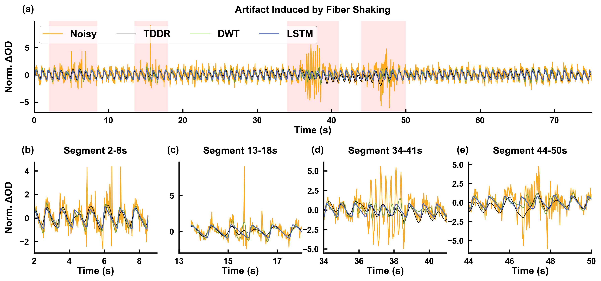
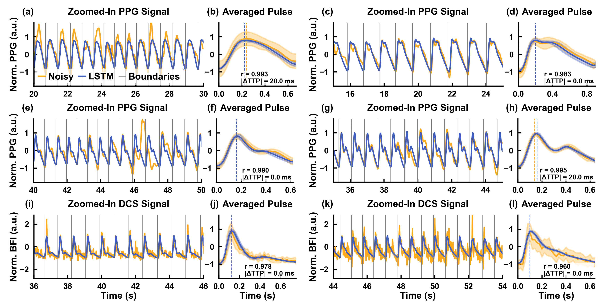

# A Synthetic-Data-Driven LSTM Framework for Tracing Cardiac Pulsation in Optical Signals

This repository accompanies the paper:

**“A Synthetic-Data-Driven LSTM Framework for Tracing Cardiac Pulsation in Optical Signals.”**

We generate physiologically realistic pulsatile signals, corrupt them with parameterized artifacts, and train a bidirectional LSTM to **trace and denoise cardiac pulsations** without annotated clinical datasets. The framework supports downstream analyses such as **heart‑rate (HR) estimation**, **pulse segmentation**, and **waveform averaging**, and is designed to be easily extended to new devices and noise conditions.

---

## Framework Pipeline

<p align="center">
  
</p>

---

## Example: Pulsation Tracing in Noisy NIRS Signal

Below we demonstrate how the model tracks pulsations during an experimental near-infrared spectroscopy (NIRS) measurement, under artifacts and noise introduced by deliberate **fiber shaking**.
The LSTM output is compared against **Discrete Wavelet Transform (DWT)** and **Temporal Derivative Distribution Repair (TDDR)** corrections, showing superior recovery of pulsations.

<p align="center">
  
</p>

---

## Example: Pulse Segmentation and Averaging

The cleaned LSTM signal allows **robust peak/valley detection**, enabling easy segmentation and averaging of pulsatile waveforms.  
Here we show **PPG** and **DCS** examples, where averaging produces stable morphology with reduced variance, critical for downstream physiological analysis.

<p align="center">
  
</p>

---

## Repository Structure

### `data_generation/`
MATLAB code for building synthetic datasets.
- **Subfolders**
  - `data/` – small example dataset (20 signals per pulse type).
  - `generate_artifacts/` – artifact generators (e.g., spikes, drifts, colored noise).
  - `generate_pulses/` – clean pulse synthesis.
  - `utils/` – filtering, FFT/spectrogram, plotting helpers.
- **Key scripts**
  - `generate_training_data.m` – large‑scale dataset synthesis.
  - `visualize_artifact.m` – artifact demonstrations.
  - `visualize_synthetic_signal.m` – clean vs. noisy signal demo.

See [`data_generation/README_data_generation.md`](data_generation/README_data_generation.md) for details.

---

### `training/`
Colab‑first workflow and scripts for model training.
- `training_lstm_colab.ipynb` – main notebook (open in Colab).
- `training_lstm_colab.py` – auto‑exported Python script.
- `requirements-train.txt` – Python dependencies for training.
- `data/` – utilities such as `convert_mat_to_npz.ipynb` and example `.npz` dataset.
  - Full dataset downloadable from KiltHub (link in the folder README).

See [`training/README_training.md`](training/README_training.md) for instructions and Colab links.

---

### `testing/`
Notebooks and scripts for evaluating trained models on **experimental** and **synthetic** data.
- Notebooks:
  - `testing_pulsation_tracing.ipynb` – end‑to‑end demo.
  - `testing_pulsation_tracing_nirs_ecg_hr_comparison.ipynb` – HR vs. ECG.
  - `testing_pulsation_tracing_nirs_ppg_dcs.ipynb` – pulse traing, segmentation, and averaging.
  - `benchmark_LSTM_with_DWT_and_TDDR.ipynb` – baselines on synthetic data.
  - `ablation_study_compare_LSTM_models.ipynb` – dataset/ablation comparisons.
- Scripts:
  - `testing_pulsation_tracing.py` – script version of the demo.
- Subfolders:
  - `experimental_data/` – example `.mat` datasets used in the paper.
  - `synthetic_data/` – synthetic datasets with ground truth for benchmarking.
  - `models/` – pre‑trained weights (see folder README for filenames).
  - `utils/` – helper modules shared by notebooks/scripts.
- `requirements_test.txt` – Python dependencies for testing.

See [`testing/README_testing.md`](testing/README_testing.md) for details.

---

## Quick Start

1. **Clone**
```bash
git clone https://github.com/jingyiwu-biophotonics/LSTM-Pulsation-Tracing.git
cd LSTM-Pulsation-Tracing
```

2. **Install**
- Testing:
  ```bash
  pip install -r testing/requirements_test.txt
  ```
- Training:
  ```bash
  pip install -r training/requirements-train.txt
  ```

3. **Run a demo**
```bash
cd testing
python testing_pulsation_tracing.py
```
> The script opens multiple Matplotlib figures; execution finishes after all figure windows are closed.  
> For Plotly interactivity in a browser, set `pio.renderers.default = "browser"` in the script.

4. **Open in Colab (optional)**
- Use the Colab badges/links in the `training` and `testing` READMEs to open notebooks directly from GitHub.

---

## Models

Pre‑trained weights are placed in `testing/models/`:
- `lstm_full_datase.pt` – main model (trained on 120k synthetic samples).
- `lstm_reduced_dataset.pt` – ablation (reduced dataset size).
- `lstm_reduced_no_colored_noise.pt` – ablation (no colored noise).
- `lstm_single_peak.pt` – trained on single‑peak pulses only (useful for HR tracking).

See `testing/models/README.md` for details and checksums.

---

## Licensing

- **Code (Python & MATLAB):** [MIT License](LICENSE)  
- **Data (synthetic & experimental):** [CC BY‑NC 4.0](https://creativecommons.org/licenses/by-nc/4.0/)

> If you plan to reuse or redistribute the datasets, please retain the original attribution and license notices.

---

## Citation

If you use this repository, please cite:

> Wu, J.\*, Bai, S.\*, Ozkaya, Z., Patel, J. A., Skog, E., Ruesch, A., Smith, M. A., & Kainerstorfer, J. M. (2025).  
> *A Synthetic-Data-Driven LSTM Framework for Tracing Cardiac Pulsation in Optical Signals.* **Biomedical Optics Express**.  
> \*These authors contributed equally.


```
@article{wu2025lstm_pulsation_tracing,
  title   = {A Synthetic-Data-Driven LSTM Framework for Tracing Cardiac Pulsation in Optical Signals},
  author  = {Wu, Jingyi and Bai, Shaojie and Ozkaya, Zeynep and Patel, Justin A. and Skog, Emily and Ruesch, Alexander and Smith, Matthew A. and Kainerstorfer, Jana M.},
  journal = {Biomedical Optics Express},
  year    = {2025},
}
```

---

## Contact
**Jingyi Wu** — jingyiwu@andrew.cmu.edu
